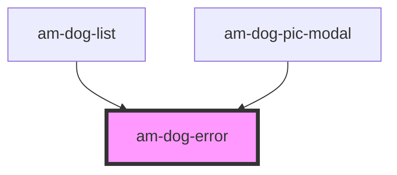

# am-dog-error

<!-- Auto Generated Below -->

## Properties

| Property       | Attribute       | Description | Type     | Default     |
| -------------- | --------------- | ----------- | -------- | ----------- |
| `errorMessage` | `error-message` |             | `string` | `undefined` |

## Dependencies

### Used by

 - [am-dog-list](../dog-list)
 - [am-dog-pic-modal](../dog-pic-modal)

### Graph

----------------------------------------------

*Built with [StencilJS](https://stenciljs.com/)*
