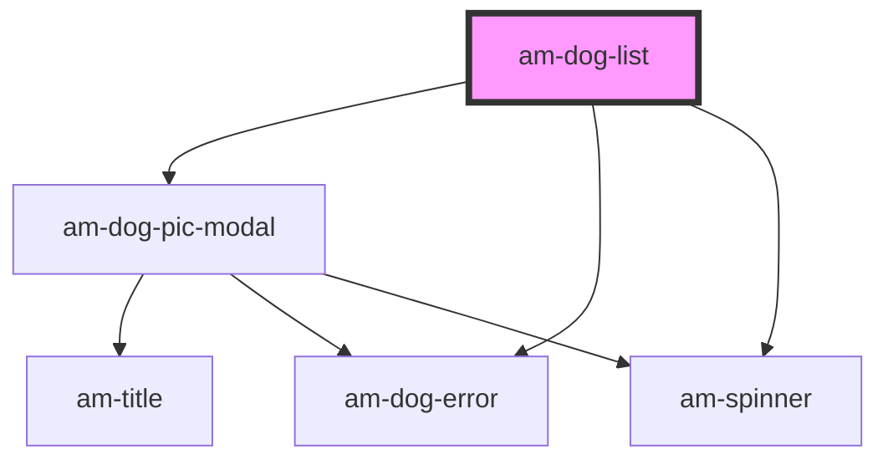

# am-dog-list

<!-- Auto Generated Below -->

## Events

| Event     | Description | Type                  |
| --------- | ----------- | --------------------- |
| `dogName` |             | `CustomEvent<string>` |

## Dependencies

### Depends on

- [am-dog-pic-modal](../dog-pic-modal)
- [am-dog-error](../dog-error)
- [am-spinner](../spinner)

### Graph

----------------------------------------------

*Built with [StencilJS](https://stenciljs.com/)*
