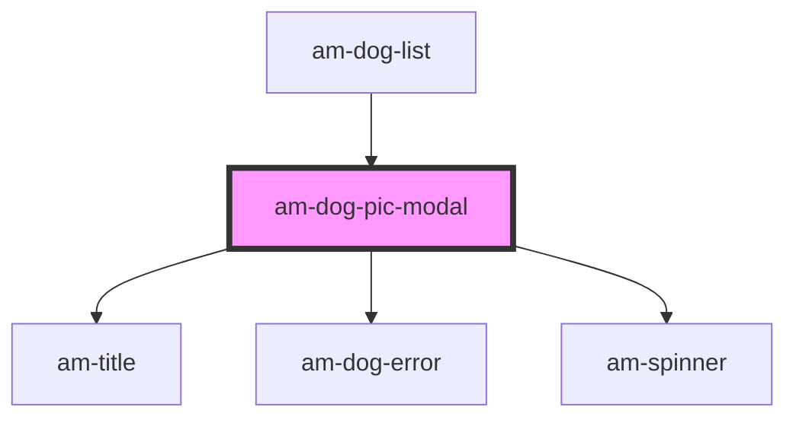

# am-dog-pic-modal

<!-- Auto Generated Below -->

## Properties

| Property   | Attribute   | Description | Type      | Default     |
| ---------- | ----------- | ----------- | --------- | ----------- |
| `dogTitle` | `dog-title` |             | `string`  | `undefined` |
| `hidden`   | `hidden`    |             | `boolean` | `undefined` |
| `saved`    | `saved`     |             | `boolean` | `undefined` |

## Dependencies

### Used by

 - [am-dog-list](../dog-list)

### Depends on

- [am-title](../title)
- [am-dog-error](../dog-error)
- [am-spinner](../spinner)

### Graph

----------------------------------------------

*Built with [StencilJS](https://stenciljs.com/)*
